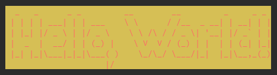

# Banana

A FIGlet utility for Java.

## What is FIGlet

[FIGlet](https://en.wikipedia.org/wiki/FIGlet) is a computer program that generates text banners, in a variety of typefaces, composed of letters made up of conglomerations of smaller ASCII characters (see [ASCII art](https://en.wikipedia.org/wiki/ASCII_art)).
The name derives from "Frank, Ian and Glenn's letters".

Being free software, FIGlet is commonly included as part of many Unix-like operating systems (Linux, BSD, etc.) distributions, but it has been ported to other platforms as well.
The official FIGlet FTP site includes precompiled ports for the Acorn, Amiga, Apple II, Atari ST, BeOS, Macintosh, MS-DOS, NeXTSTEP, OS/2, and Windows platforms, as well as a reimplementation in Perl (Text::FIGlet).
There are third-party reimplementations of FIGlet in Java (including one embedded in the JavE ASCII art editor), JavaScript, PHP and Python. FIGlet was featured as a Debian Package of the Day in 2007.

## Dependency

### Maven

```xml
<dependency>
    <groupId>io.leego</groupId>
    <artifactId>banana</artifactId>
    <version>2.1.0</version>
</dependency>
```

### Gradle

```xml
implementation 'io.leego:banana:2.1.0'
```

## Usage

### Example

```java
BananaUtils.bananaify("Hello, Banana!");
```

```
  _   _      _ _          ____                                _ 
 | | | | ___| | | ___    | __ )  __ _ _ __   __ _ _ __   __ _| |
 | |_| |/ _ \ | |/ _ \   |  _ \ / _` | '_ \ / _` | '_ \ / _` | |
 |  _  |  __/ | | (_) |  | |_) | (_| | | | | (_| | | | | (_| |_|
 |_| |_|\___|_|_|\___( ) |____/ \__,_|_| |_|\__,_|_| |_|\__,_(_)
                     |/                                         
```

### Multiline

```java
String s = "ABCDEFGHIJKLMNOPQRSTUVWXYZ\n"
        + "abcdefghijklmnopqrstuvwxyz\n"
        + "1234567890" + ". : , ; ' \" \\ ( ! ? ) + - * / =";
BananaUtils.bananaify(s);
```

```
     _    ____   ____ ____  _____ _____ ____ _   _ ___    _ _  ___     __  __ _   _  ___  ____   ___  ____  ____ _____ _   ___     ____        ____  ____   _______
    / \  | __ ) / ___|  _ \| ____|  ___/ ___| | | |_ _|  | | |/ / |   |  \/  | \ | |/ _ \|  _ \ / _ \|  _ \/ ___|_   _| | | \ \   / /\ \      / /\ \/ /\ \ / /__  /
   / _ \ |  _ \| |   | | | |  _| | |_ | |  _| |_| || |_  | | ' /| |   | |\/| |  \| | | | | |_) | | | | |_) \___ \ | | | | | |\ \ / /  \ \ /\ / /  \  /  \ V /  / / 
  / ___ \| |_) | |___| |_| | |___|  _|| |_| |  _  || | |_| | . \| |___| |  | | |\  | |_| |  __/| |_| |  _ < ___) || | | |_| | \ V /    \ V  V /   /  \   | |  / /_ 
 /_/   \_\____/ \____|____/|_____|_|   \____|_| |_|___\___/|_|\_\_____|_|  |_|_| \_|\___/|_|    \__\_\_| \_\____/ |_|  \___/   \_/      \_/\_/   /_/\_\  |_| /____|
   __ _| |__   ___ __| | ___ / _| __ _| |__ (_)(_) | _| |_ __ ___  _ __   ___  _ __   __ _ _ __ ___| |_ _   ___   ____      ____  ___   _ ____                     
  / _` | '_ \ / __/ _` |/ _ \ |_ / _` | '_ \| || | |/ / | '_ ` _ \| '_ \ / _ \| '_ \ / _` | '__/ __| __| | | \ \ / /\ \ /\ / /\ \/ / | | |_  /                     
 | (_| | |_) | (_| (_| |  __/  _| (_| | | | | || |   <| | | | | | | | | | (_) | |_) | (_| | |  \__ \ |_| |_| |\ V /  \ V  V /  >  <| |_| |/ /                      
  \__,_|_.__/ \___\__,_|\___|_|  \__, |_| |_|_|/ |_|\_\_|_| |_| |_|_| |_|\___/| .__/ \__, |_|  |___/\__|\__,_| \_/    \_/\_/  /_/\_\\__, /___|                     
  _ ____  _____ _  _  ____   __ _|___/___  __|__/___                 _   _ _  |_|      _|_|_   ___  __                              |___/                          
 / |___ \|___ /| || || ___| / /|___  ( _ )/ _ \ / _ \    _       _  ( ) ( | ) \ \     / / | | |__ \ \ \     _            __/\__    / /  _____                      
 | | __) | |_ \| || ||___ \| '_ \ / // _ \ (_) | | | |  (_)     (_) |/   V V   \ \   | |  | |   / /  | |  _| |_   _____  \    /   / /  |_____|                     
 | |/ __/ ___) |__   _|__) | (_) / /| (_) \__, | |_| |   _   _   _              \ \  | |  |_|  |_|   | | |_   _| |_____| /_  _\  / /   |_____|                     
 |_|_____|____/   |_||____/ \___/_/  \___/  /_/ \___(_) (_) ( ) ( )              \_\ | |  (_)  (_)   | |   |_|             \/   /_/                                
                                                            |/  |/                    \_\           /_/                                                            
```

### Fonts

Click [here](docs/FONTS.md) to see more fonts.

#### 3D-ASCII

```java
BananaUtils.bananaify("Hello, World!", Font.THREE_D_ASCII);
```

```
 ___  ___  _______   ___       ___       ________                ___       __   ________  ________  ___       ________  ___       
|\  \|\  \|\  ___ \ |\  \     |\  \     |\   __  \              |\  \     |\  \|\   __  \|\   __  \|\  \     |\   ___ \|\  \      
\ \  \\\  \ \   __/|\ \  \    \ \  \    \ \  \|\  \             \ \  \    \ \  \ \  \|\  \ \  \|\  \ \  \    \ \  \_|\ \ \  \     
 \ \   __  \ \  \_|/_\ \  \    \ \  \    \ \  \\\  \  ___        \ \  \  __\ \  \ \  \\\  \ \   _  _\ \  \    \ \  \ \\ \ \  \    
  \ \  \ \  \ \  \_|\ \ \  \____\ \  \____\ \  \\\  \|\  \        \ \  \|\__\_\  \ \  \\\  \ \  \\  \\ \  \____\ \  \_\\ \ \__\   
   \ \__\ \__\ \_______\ \_______\ \_______\ \_______\ \  \        \ \____________\ \_______\ \__\\ _\\ \_______\ \_______\|__|   
    \|__|\|__|\|_______|\|_______|\|_______|\|_______|\/  /|        \|____________|\|_______|\|__|\|__|\|_______|\|_______|   ___ 
                                                    |\___/ /                                                                 |\__\
                                                    \|___|/                                                                  \|__|
                                                                                                                                  
```

#### ANSI Shadow

```java
BananaUtils.bananaify("Hello, World!", Font.ANSI_SHADOW);
```

```
██╗  ██╗███████╗██╗     ██╗      ██████╗        ██╗    ██╗ ██████╗ ██████╗ ██╗     ██████╗ ██╗
██║  ██║██╔════╝██║     ██║     ██╔═══██╗       ██║    ██║██╔═══██╗██╔══██╗██║     ██╔══██╗██║
███████║█████╗  ██║     ██║     ██║   ██║       ██║ █╗ ██║██║   ██║██████╔╝██║     ██║  ██║██║
██╔══██║██╔══╝  ██║     ██║     ██║   ██║       ██║███╗██║██║   ██║██╔══██╗██║     ██║  ██║╚═╝
██║  ██║███████╗███████╗███████╗╚██████╔╝▄█╗    ╚███╔███╔╝╚██████╔╝██║  ██║███████╗██████╔╝██╗
╚═╝  ╚═╝╚══════╝╚══════╝╚══════╝ ╚═════╝ ╚═╝     ╚══╝╚══╝  ╚═════╝ ╚═╝  ╚═╝╚══════╝╚═════╝ ╚═╝
                                                                                              
```

#### Small

```java
BananaUtils.bananaify("Hello, World!", Font.SMALL);
```

```
  _  _     _ _        __      __       _    _ _ 
 | || |___| | |___    \ \    / /__ _ _| |__| | |
 | __ / -_) | / _ \_   \ \/\/ / _ \ '_| / _` |_|
 |_||_\___|_|_\___( )   \_/\_/\___/_| |_\__,_(_)
                  |/                            
```

#### Bloody

```java
BananaUtils.bananaify("Hello, World!", Font.BLOODY);
```

```
 ██░ ██ ▓█████  ██▓     ██▓     ▒█████      █     █░ ▒█████   ██▀███   ██▓    ▓█████▄  ▐██▌ 
▓██░ ██▒▓█   ▀ ▓██▒    ▓██▒    ▒██▒  ██▒   ▓█░ █ ░█░▒██▒  ██▒▓██ ▒ ██▒▓██▒    ▒██▀ ██▌ ▐██▌ 
▒██▀▀██░▒███   ▒██░    ▒██░    ▒██░  ██▒   ▒█░ █ ░█ ▒██░  ██▒▓██ ░▄█ ▒▒██░    ░██   █▌ ▐██▌ 
░▓█ ░██ ▒▓█  ▄ ▒██░    ▒██░    ▒██   ██░   ░█░ █ ░█ ▒██   ██░▒██▀▀█▄  ▒██░    ░▓█▄   ▌ ▓██▒ 
░▓█▒░██▓░▒████▒░██████▒░██████▒░ ████▓▒░   ░░██▒██▓ ░ ████▓▒░░██▓ ▒██▒░██████▒░▒████▓  ▒▄▄  
 ▒ ░░▒░▒░░ ▒░ ░░ ▒░▓  ░░ ▒░▓  ░░ ▒░▒░▒░    ░ ▓░▒ ▒  ░ ▒░▒░▒░ ░ ▒▓ ░▒▓░░ ▒░▓  ░ ▒▒▓  ▒  ░▀▀▒ 
 ▒ ░▒░ ░ ░ ░  ░░ ░ ▒  ░░ ░ ▒  ░  ░ ▒ ▒░      ▒ ░ ░    ░ ▒ ▒░   ░▒ ░ ▒░░ ░ ▒  ░ ░ ▒  ▒  ░  ░ 
 ░  ░░ ░   ░     ░ ░     ░ ░   ░ ░ ░ ▒       ░   ░  ░ ░ ░ ▒    ░░   ░   ░ ░    ░ ░  ░     ░ 
 ░  ░  ░   ░  ░    ░  ░    ░  ░    ░ ░         ░        ░ ░     ░         ░  ░   ░     ░    
                                                                               ░            
```

### Layout

Click [here](docs/LAYOUTS.md) to see more layouts.

#### FITTED

```java
BananaUtils.bananaify("Bananas have their own characteristic smell, \nand they are easily digestible.", Layout.FITTED, Layout.FITTED);
```

```
  ____                                            _                          _    _            _                                       _                               _               _       _    _                               _  _     
 | __ )   __ _  _ __    __ _  _ __    __ _  ___  | |__    __ _ __   __ ___  | |_ | |__    ___ (_) _ __    ___ __      __ _ __     ___ | |__    __ _  _ __  __ _   ___ | |_  ___  _ __ (_) ___ | |_ (_)  ___   ___  _ __ ___    ___ | || |    
 |  _ \  / _` || '_ \  / _` || '_ \  / _` |/ __| | '_ \  / _` |\ \ / // _ \ | __|| '_ \  / _ \| || '__|  / _ \\ \ /\ / /| '_ \   / __|| '_ \  / _` || '__|/ _` | / __|| __|/ _ \| '__|| |/ __|| __|| | / __| / __|| '_ ` _ \  / _ \| || |    
 | |_) || (_| || | | || (_| || | | || (_| |\__ \ | | | || (_| | \ V /|  __/ | |_ | | | ||  __/| || |    | (_) |\ V  V / | | | | | (__ | | | || (_| || |  | (_| || (__ | |_|  __/| |   | |\__ \| |_ | || (__  \__ \| | | | | ||  __/| || | _  
 |____/  \__,_||_| |_| \__,_||_| |_| \__,_||___/ |_| |_| \__,_|  \_/  \___|  \__||_| |_| \___||_||_|     \___/  \_/\_/  |_| |_|  \___||_| |_| \__,_||_|   \__,_| \___| \__|\___||_|   |_||___/ \__||_| \___| |___/|_| |_| |_| \___||_||_|( ) 
                    _   _    _                                                         _  _              _  _                    _    _  _      _                                                                                        |/  
   __ _  _ __    __| | | |_ | |__    ___  _   _    __ _  _ __  ___    ___   __ _  ___ (_)| | _   _    __| |(_)  __ _   ___  ___ | |_ (_)| |__  | |  ___                                                                                      
  / _` || '_ \  / _` | | __|| '_ \  / _ \| | | |  / _` || '__|/ _ \  / _ \ / _` |/ __|| || || | | |  / _` || | / _` | / _ \/ __|| __|| || '_ \ | | / _ \                                                                                     
 | (_| || | | || (_| | | |_ | | | ||  __/| |_| | | (_| || |  |  __/ |  __/| (_| |\__ \| || || |_| | | (_| || || (_| ||  __/\__ \| |_ | || |_) || ||  __/ _                                                                                   
  \__,_||_| |_| \__,_|  \__||_| |_| \___| \__, |  \__,_||_|   \___|  \___| \__,_||___/|_||_| \__, |  \__,_||_| \__, | \___||___/ \__||_||_.__/ |_| \___|(_)                                                                                  
                                          |___/                                              |___/             |___/                                                                                                                         
```

#### SMUSH_U

```java
BananaUtils.bananaify("Bananas have their own characteristic smell, \nand they are easily digestible.", Layout.SMUSH_U, Layout.SMUSH_U);
```

```
  ____                                      _                       _   _          _                                   _                          _            _     _   _                           _ _    
 | __ )  __ _ _ __   __ _ _ __   __ _ ___  | |__   __ ___   _____  | |_| |__   ___(_)_ __    _____      ___ __     ___| |__   __ _ _ __ __ _  ___| |_ ___ _ __(_)___| |_(_) ___   ___ _ __ ___   ___| | |   
 |  _ \ / _` | '_ \ / _` | '_ \ / _` / __| | '_ \ / _` \ \ / / _ \ | __| '_ \ / _ | | '__|  / _ \ \ /\ / | '_ \   / __| '_ \ / _` | '__/ _` |/ __| __/ _ | '__| / __| __| |/ __| / __| '_ ` _ \ / _ | | |   
 | |_) | (_| | | | | (_| | | | | (_| \__ \ | | | | (_| |\ V |  __/ | |_| | | |  __| | |    | (_) \ V  V /| | | | | (__| | | | (_| | | | (_| | (__| ||  __| |  | \__ | |_| | (__  \__ | | | | | |  __| | |_  
 |____/ \__,_|_| |_|\__,_|_| |_|\__,_|___/ |_| |_|\__,_| \_/ \___|  \__|_| |__\___|_|_|     \___/ \_/\_/ |_| |_|_ \_____| |__\__,_|_|  \__,_|\___|\__\___|_|  |_|___/\__|_|\___| |___|_| |_| |_|\___|_|_( ) 
   __ _ _ __   __| | | |_| |__   ___ _   _    __ _ _ __ ___    ___  __ _ ___(_| |_   _    __| (_) __ _  ___ ___| |_(_| |__ | | ___                                                                      |/  
  / _` | '_ \ / _` | | __| '_ \ / _ | | | |  / _` | '__/ _ \  / _ \/ _` / __| | | | | |  / _` | |/ _` |/ _ / __| __| | '_ \| |/ _ \                                                                         
 | (_| | | | | (_| | | |_| | | |  __| |_| | | (_| | | |  __/ |  __| (_| \__ | | | |_| | | (_| | | (_| |  __\__ | |_| | |_) | |  __/_                                                                        
  \__,_|_| |_|\__,_|  \__|_| |_|\___|\__, |  \__,_|_|  \___|  \___|\__,_|___|_|_|\__, |  \__,_|_|\__, |\___|___/\__|_|_.__/|_|\___(_)                                                                       
                                     |___/                                       |___/           |___/                                                                                                      
```

### ANSI

```java
BananaUtils.bananansi("Hello, World!", Ansi.BLUE);
```


```java
BananaUtils.bananansi("Hello, World!", Ansi.RED, Ansi.BG_YELLOW);
```



## Contact

> * Bugs & Issues: [Click Here](https://github.com/yihleego/banana/issues)

## License

Banana is under the MIT license. See the [LICENSE](LICENSE) file for details.